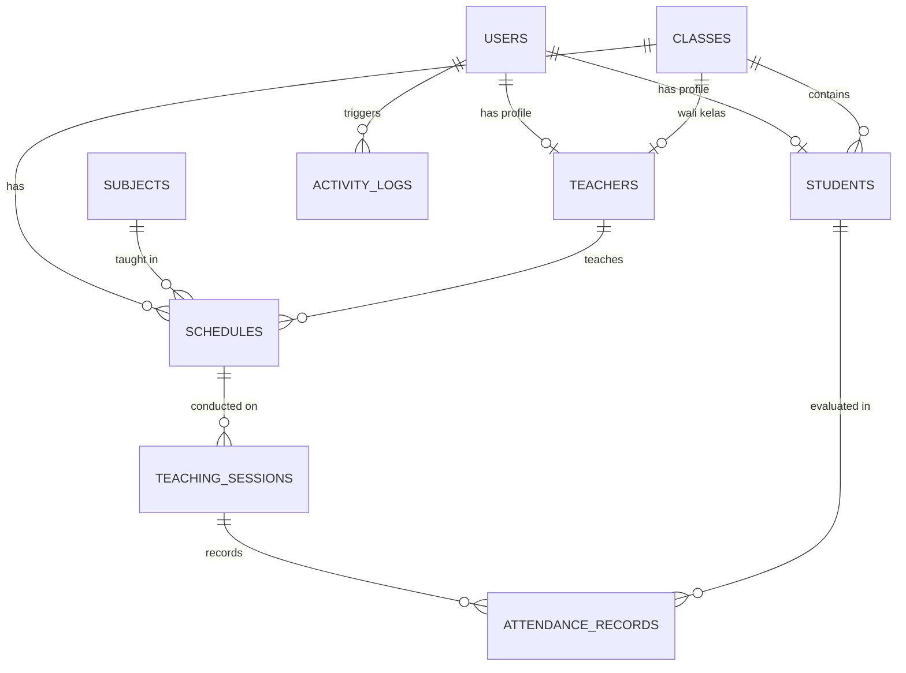
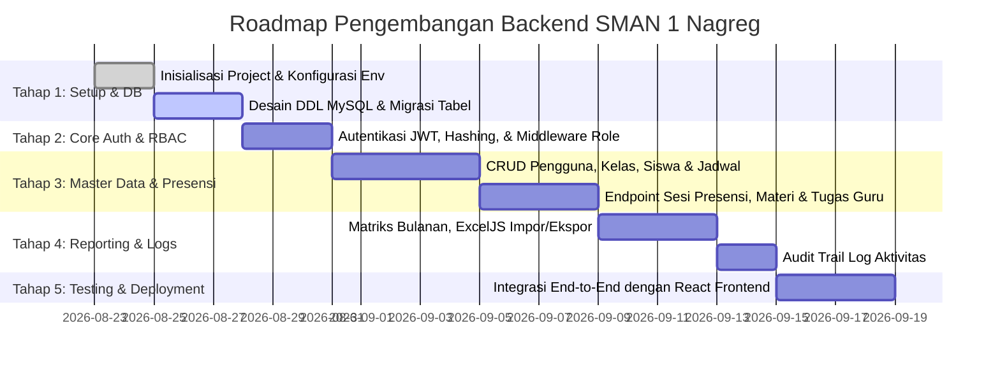

# 📋 Product Requirements Document (PRD)
## Backend RESTful API & Database Sistem Presensi SMAN 1 Nagreg

---

## 📌 1. Executive Summary & Project Overview

### 1.1 Deskripsi Produk
Backend Sistem Presensi SMAN 1 Nagreg adalah arsitektur server terpusat berbasis **RESTful API** yang dirancang untuk mendukung seluruh kebutuhan operasional frontend presensi digital di lingkungan SMAN 1 Nagreg. Backend ini menangani autentikasi berbasis peran (*multi-role*), pencatatan presensi siswa per sesi kelas secara *real-time*, manajemen data master (Pengguna, Kelas, Siswa, Guru, Jadwal Mata Pelajaran), pelaporan matriks bulanan, ekspor/impor file spreadsheet Excel, serta pencatatan jejak audit (*activity log*).

### 1.2 Tujuan Utama (Goals)
1. **Keandalan & Integritas Data**: Menyediakan basis data relasional terstruktur (MySQL) dengan integritas referensial dan transaksi aman.
2. **Kinerja Cepat & Terukur**: Memproses kueri rekapitulasi, matriks bulanan, dan presensi kelas dalam waktu respon < 200ms.
3. **Keamanan Tingkat Tinggi**: Menerapkan enkripsi kata sandi kuat (*bcrypt*), autentikasi *stateless* menggunakan JSON Web Token (JWT), otorisasi berbasis peran (RBAC), pembatasan laju kueri (*rate limiting*), serta perlindungan header keamanan HTTP (*Helmet*).
4. **Keselarasan Frontend & Backend**: Menjamin setiap kontrak data API (DTO & response payload) cocok 100% dengan kebutuhan tampilan UI/UX React frontend yang telah dibangun.

---

## 🛠️ 2. Technology Stack & Environment

| Komponen | Teknologi / Pustaka | Versi Rekomendasi | Deskripsi & Peran |
| :--- | :--- | :--- | :--- |
| **Runtime Environment** | Node.js | `>= 18.x LTS` | Lingkungan runtime JavaScript sisi server. |
| **Web Framework** | Express.js | `^4.19.x` | Framework HTTP server untuk pembuatan REST API modular. |
| **Database Engine** | MySQL Server | `>= 8.0` | Database relasional untuk penyimpanan data presensi & master. |
| **ORM / Database Driver** | Prisma / Sequelize / `mysql2` | Versi stabil | Pengelolaan koneksi pool, migrasi skema, dan query builder. |
| **Autentikasi & Enkripsi** | `jsonwebtoken`, `bcryptjs` | `^9.x`, `^2.4.x` | Pembuatan token JWT dan hashing kata sandi satu arah. |
| **Validasi Request** | `joi` / `zod` | Versi stabil | Validasi skema input body, params, dan query request. |
| **File Processing & Excel** | `multer`, `exceljs` | Versi stabil | Menangani upload file multipart dan pemrosesan impor/ekspor Excel. |
| **Keamanan & Middleware** | `cors`, `helmet`, `express-rate-limit`, `morgan` | Versi stabil | Keamanan CORS, proteksi header HTTP, rate limiter, dan request logger. |
| **Environment Config** | `dotenv` | `^16.x` | Manajemen variabel lingkungan (`.env`). |

---

## 👥 3. User Roles & Permission Matrix (RBAC)

| Modul / Fitur | Administrator (`admin`) | Guru Pengajar (`guru`) | Siswa (`siswa`) |
| :--- | :---: | :---: | :---: |
| **Autentikasi & Ubah Password** | ✅ Penuh | ✅ Penuh | ✅ Penuh |
| **Executive Dashboard Analytics** | ✅ Penuh | ❌ | ❌ |
| **Dashboard Guru & Jadwal Hari Ini** | ❌ | ✅ Penuh | ❌ |
| **Dashboard Siswa & Ringkasan Pribadi** | ❌ | ❌ | ✅ Penuh |
| **Manajemen Pengguna (CRUD & Import Excel)** | ✅ Penuh | ❌ | ❌ |
| **Manajemen Kelas & Mutasi Siswa** | ✅ Penuh | ❌ | ❌ |
| **Manajemen Jadwal Pelajaran** | ✅ Penuh | ❌ | ❌ |
| **Input & Edit Presensi Sesi Kelas** | ✅ (Supervisi) | ✅ (Kelas Sendiri) | ❌ |
| **Input Materi, Tugas & Kuis Guru** | ❌ | ✅ (Kelas Sendiri) | ❌ (Hanya Baca) |
| **Rekapitulasi Presensi Multi-Dimensi** | ✅ Penuh | ✅ (Kelas Terkait) | ❌ |
| **Laporan Bulanan & Ekspor Excel** | ✅ Penuh | ✅ (Kelas Terkait) | ❌ |
| **Riwayat Presensi Pribadi / Mengajar** | ✅ Penuh | ✅ Penuh | ✅ Penuh |
| **Audit Log Aktivitas Sistem & Ekspor** | ✅ Penuh | ❌ | ❌ |

---

## 🗄️ 4. Database Schema Design (MySQL Entity Relationship)

### 4.1 Diagram Hubungan Entitas (ERD)



---

### 4.2 Spesifikasi Struktur Tabel

#### 1. Tabel `users`
Menyimpan kredensial autentikasi untuk seluruh akun dalam sistem.

| Nama Kolom | Tipe Data | Constraint | Deskripsi |
| :--- | :--- | :--- | :--- |
| `id` | `INT UNSIGNED` | `PRIMARY KEY, AUTO_INCREMENT` | ID unik pengguna. |
| `username` | `VARCHAR(50)` | `NOT NULL, UNIQUE` | Username unik untuk login. |
| `password` | `VARCHAR(255)` | `NOT NULL` | Hash kata sandi (*bcrypt*). |
| `role` | `ENUM('admin', 'guru', 'siswa')` | `NOT NULL` | Peran hak akses pengguna. |
| `nama` | `VARCHAR(100)` | `NOT NULL` | Nama lengkap pengguna. |
| `email` | `VARCHAR(100)` | `NULL, UNIQUE` | Alamat email (opsional). |
| `is_active` | `BOOLEAN` | `DEFAULT TRUE` | Status aktif akun. |
| `created_at` | `DATETIME` | `DEFAULT CURRENT_TIMESTAMP` | Waktu akun dibuat. |
| `updated_at` | `DATETIME` | `DEFAULT CURRENT_TIMESTAMP ON UPDATE CURRENT_TIMESTAMP` | Waktu pembaruan akun. |

#### 2. Tabel `teachers`
Informasi profil tambahan khusus guru pengajar.

| Nama Kolom | Tipe Data | Constraint | Deskripsi |
| :--- | :--- | :--- | :--- |
| `id` | `INT UNSIGNED` | `PRIMARY KEY, AUTO_INCREMENT` | ID profil guru. |
| `user_id` | `INT UNSIGNED` | `NOT NULL, UNIQUE, FK -> users(id)` | Referensi akun pengguna. |
| `nip` | `VARCHAR(30)` | `NULL, UNIQUE` | Nomor Induk Pegawai. |
| `gelar` | `VARCHAR(30)` | `NULL` | Gelar akademis (cth: S.Pd, M.M). |
| `spesialisasi` | `VARCHAR(100)` | `NULL` | Bidang studi pengampu. |
| `created_at` | `DATETIME` | `DEFAULT CURRENT_TIMESTAMP` | Waktu data dibuat. |

#### 3. Tabel `classes`
Informasi data kelas dari tingkat X, XI, hingga XII.

| Nama Kolom | Tipe Data | Constraint | Deskripsi |
| :--- | :--- | :--- | :--- |
| `id` | `INT UNSIGNED` | `PRIMARY KEY, AUTO_INCREMENT` | ID unik kelas. |
| `nama_kelas` | `VARCHAR(20)` | `NOT NULL, UNIQUE` | Nama kelas (cth: X-1, XI-3, XII-1). |
| `tingkat` | `ENUM('X', 'XI', 'XII')` | `NOT NULL` | Tingkat jenjang kelas. |
| `wali_kelas_id`| `INT UNSIGNED` | `NULL, FK -> teachers(id)` | Guru wali kelas yang ditugaskan. |
| `tahun_ajaran` | `VARCHAR(20)` | `DEFAULT '2025/2026'` | Tahun ajaran akademik aktif. |
| `created_at` | `DATETIME` | `DEFAULT CURRENT_TIMESTAMP` | Waktu pembuatan kelas. |

#### 4. Tabel `students`
Informasi siswa dan pemetaan ke rombongan belajar / kelas.

| Nama Kolom | Tipe Data | Constraint | Deskripsi |
| :--- | :--- | :--- | :--- |
| `id` | `INT UNSIGNED` | `PRIMARY KEY, AUTO_INCREMENT` | ID unik siswa. |
| `user_id` | `INT UNSIGNED` | `NOT NULL, UNIQUE, FK -> users(id)` | Referensi akun pengguna siswa. |
| `kelas_id` | `INT UNSIGNED` | `NOT NULL, FK -> classes(id)` | Kelas yang diikuti siswa. |
| `nipd` | `VARCHAR(30)` | `NOT NULL, UNIQUE` | Nomor Induk Peserta Didik (ID/NIS). |
| `nisn` | `VARCHAR(30)` | `NULL, UNIQUE` | Nomor Induk Siswa Nasional. |
| `gender` | `ENUM('L', 'P')` | `NOT NULL DEFAULT 'L'` | Jenis kelamin (Laki-laki / Perempuan). |
| `created_at` | `DATETIME` | `DEFAULT CURRENT_TIMESTAMP` | Waktu data siswa dibuat. |

#### 5. Tabel `subjects`
Daftar mata pelajaran yang diajarkan di sekolah.

| Nama Kolom | Tipe Data | Constraint | Deskripsi |
| :--- | :--- | :--- | :--- |
| `id` | `INT UNSIGNED` | `PRIMARY KEY, AUTO_INCREMENT` | ID mata pelajaran. |
| `kode_mapel` | `VARCHAR(20)` | `NOT NULL, UNIQUE` | Kode unik mata pelajaran. |
| `nama_mapel` | `VARCHAR(100)` | `NOT NULL` | Nama mata pelajaran (cth: Matematika, Fisika). |
| `kategori` | `VARCHAR(50)` | `DEFAULT 'Umum'` | Kelompok mata pelajaran (Umum, MIPA, IPS, Bahasa). |
| `created_at` | `DATETIME` | `DEFAULT CURRENT_TIMESTAMP` | Waktu pembuatan mata pelajaran. |

#### 6. Tabel `schedules`
Jadwal mata pelajaran mingguan per kelas dan guru pengampu.

| Nama Kolom | Tipe Data | Constraint | Deskripsi |
| :--- | :--- | :--- | :--- |
| `id` | `INT UNSIGNED` | `PRIMARY KEY, AUTO_INCREMENT` | ID jadwal pelajaran. |
| `mapel_id` | `INT UNSIGNED` | `NOT NULL, FK -> subjects(id)` | Mata pelajaran yang diajarkan. |
| `kelas_id` | `INT UNSIGNED` | `NOT NULL, FK -> classes(id)` | Kelas target. |
| `teacher_id`| `INT UNSIGNED` | `NOT NULL, FK -> teachers(id)` | Guru pengampu jadwal. |
| `hari` | `ENUM('Senin', 'Selasa', 'Rabu', 'Kamis', 'Jumat', 'Sabtu')` | `NOT NULL` | Hari pelaksanaan jadwal. |
| `jam_mulai` | `VARCHAR(10)` | `NOT NULL` | Format jam mulai (cth: `07:30`). |
| `jam_selesai`| `VARCHAR(10)` | `NOT NULL` | Format jam selesai (cth: `09:00`). |
| `ruang` | `VARCHAR(50)` | `DEFAULT 'Ruang Kelas'` | Ruangan pelaksanaan kelas. |
| `status` | `ENUM('Offline', 'Online')` | `DEFAULT 'Offline'` | Status metode pembelajaran. |
| `created_at` | `DATETIME` | `DEFAULT CURRENT_TIMESTAMP` | Waktu jadwal dibuat. |

#### 7. Tabel `teaching_sessions`
Sesi pertemuan belajar mengajar aktual yang dibuka dan dicatat guru.

| Nama Kolom | Tipe Data | Constraint | Deskripsi |
| :--- | :--- | :--- | :--- |
| `id` | `INT UNSIGNED` | `PRIMARY KEY, AUTO_INCREMENT` | ID sesi pembelajaran. |
| `schedule_id`| `INT UNSIGNED` | `NOT NULL, FK -> schedules(id)` | Referensi jadwal pelajaran. |
| `tanggal` | `DATE` | `NOT NULL` | Tanggal pelaksanaan sesi kelas. |
| `status_sesi`| `ENUM('Belum Dimulai', 'Sedang Berlangsung', 'Selesai')` | `DEFAULT 'Belum Dimulai'` | Status aktivitas sesi mengajar. |
| `topik_materi`| `VARCHAR(200)` | `NULL` | Judul / Topik materi yang diajarkan guru. |
| `deskripsi_materi` | `TEXT` | `NULL` | Ringkasan materi pembelajaran dari guru. |
| `tugas_siswa`| `TEXT` | `NULL` | Instruksi latihan / tugas siswa. |
| `kuis_evaluasi` | `TEXT` | `NULL` | Rincian kuis / evaluasi harian siswa. |
| `created_at` | `DATETIME` | `DEFAULT CURRENT_TIMESTAMP` | Waktu sesi dibuat. |
| `updated_at` | `DATETIME` | `DEFAULT CURRENT_TIMESTAMP ON UPDATE CURRENT_TIMESTAMP` | Waktu sesi diperbarui. |

#### 8. Tabel `attendance_records`
Catatan kehadiran setiap siswa pada sesi pembelajaran tertentu.

| Nama Kolom | Tipe Data | Constraint | Deskripsi |
| :--- | :--- | :--- | :--- |
| `id` | `BIGINT UNSIGNED` | `PRIMARY KEY, AUTO_INCREMENT` | ID catatan presensi. |
| `session_id` | `INT UNSIGNED` | `NOT NULL, FK -> teaching_sessions(id)` | Sesi pembelajaran yang diikuti. |
| `student_id` | `INT UNSIGNED` | `NOT NULL, FK -> students(id)` | Siswa yang dinilai kehadirannya. |
| `status` | `ENUM('Hadir', 'Sakit', 'Izin', 'Alpa')` | `NOT NULL DEFAULT 'Hadir'` | Status presensi siswa. |
| `catatan` | `VARCHAR(255)` | `NULL` | Catatan opsional dari guru. |
| `created_at` | `DATETIME` | `DEFAULT CURRENT_TIMESTAMP` | Waktu pencatatan. |
| `updated_at` | `DATETIME` | `DEFAULT CURRENT_TIMESTAMP ON UPDATE CURRENT_TIMESTAMP` | Waktu pembaruan presensi. |

#### 9. Tabel `activity_logs`
Audit trail seluruh aktivitas sistem (Autentikasi, Presensi, Import/Export, User Management).

| Nama Kolom | Tipe Data | Constraint | Deskripsi |
| :--- | :--- | :--- | :--- |
| `id` | `BIGINT UNSIGNED` | `PRIMARY KEY, AUTO_INCREMENT` | ID log aktivitas. |
| `user_id` | `INT UNSIGNED` | `NULL, FK -> users(id)` | Pengguna yang melakukan aktivitas. |
| `nama_user` | `VARCHAR(100)` | `NOT NULL` | Nama pengguna pada saat aksi dilakukan. |
| `role` | `VARCHAR(20)` | `NOT NULL` | Peran pengguna (`admin`, `guru`, `siswa`). |
| `kategori` | `VARCHAR(50)` | `NOT NULL` | Kategori (`Presensi`, `Laporan`, `Manajemen Pengguna`, dll). |
| `aksi` | `VARCHAR(100)` | `NOT NULL` | Nama aksi (cth: `Input Presensi Sesi`). |
| `deskripsi` | `TEXT` | `NOT NULL` | Keterangan rinci aktivitas. |
| `status` | `ENUM('success', 'info', 'warning', 'error')` | `DEFAULT 'success'` | Status hasil operasi. |
| `ip_address` | `VARCHAR(45)` | `NULL` | Alamat IP pengguna. |
| `user_agent` | `VARCHAR(255)` | `NULL` | Browser dan perangkat pengguna. |
| `payload_detail` | `JSON` | `NULL` | Data parameter / payload JSON aktivitas. |
| `created_at` | `DATETIME` | `DEFAULT CURRENT_TIMESTAMP` | Waktu kejadian aktivitas. |

---

## 🌐 5. RESTful API Specification (Endpoints Contract)

Format standar response JSON:
```json
{
  "success": true,
  "message": "Deskripsi respon status",
  "data": {},
  "meta": {
    "page": 1,
    "limit": 10,
    "totalItems": 50,
    "totalPages": 5
  }
}
```

Format standar error response:
```json
{
  "success": false,
  "message": "Pesan kesalahan validasi / otorisasi",
  "errors": []
}
```

---

### 5.1 Modul Autentikasi (`/api/auth`)

| Metode | Endpoint | Hak Akses | Deskripsi | Request Body / Query |
| :--- | :--- | :--- | :--- | :--- |
| `POST` | `/api/auth/login` | Publik | Login pengguna & mendapatkan token JWT. | `{ "username": "admin", "password": "..." }` |
| `GET` | `/api/auth/me` | Authenticated | Mendapatkan profil pengguna aktif. | Headers: `Authorization: Bearer <token>` |
| `POST` | `/api/auth/logout` | Authenticated | Invalidate token sesi & catat aktivitas. | Headers: `Authorization: Bearer <token>` |
| `PUT` | `/api/auth/change-password` | Authenticated | Ubah kata sandi akun login. | `{ "oldPassword": "...", "newPassword": "..." }` |

---

### 5.2 Modul Dashboard (`/api/dashboard`)

| Metode | Endpoint | Hak Akses | Deskripsi | Output Utama |
| :--- | :--- | :--- | :--- | :--- |
| `GET` | `/api/dashboard/admin` | Admin | Statistik rekap sekolah, kelas terbaik, metrik kehadiran. | `{ totalSiswa, totalGuru, totalKelas, persentaseKehadiran, leadingClasses, attentionClasses, stats }` |
| `GET` | `/api/dashboard/guru` | Guru | Jadwal mengajar hari ini & status sesi kelas. | `{ todaySchedules, totalSesiAkanDatang, sesiSelesai }` |
| `GET` | `/api/dashboard/siswa` | Siswa | Persentase presensi pribadi & jadwal hari ini. | `{ persentaseHadir, hadir, sakit, izin, alpa, jadwalHariIni }` |

---

### 5.3 Modul Presensi & Sesi Pembelajaran (`/api/presensi`)

| Metode | Endpoint | Hak Akses | Deskripsi | Payload / Parameter |
| :--- | :--- | :--- | :--- | :--- |
| `GET` | `/api/presensi/rekapitulasi` | Admin / Guru | Rekap kehadiran dengan filter tanggal & kelas. | Query: `?kelas=X-1&startDate=...&endDate=...` |
| `GET` | `/api/presensi/bulanan` | Admin / Guru | Matriks kehadiran bulanan (H, S, I, A) per tanggal. | Query: `?bulan=8&tahun=2026&kelas=X-1` |
| `GET` | `/api/presensi/sesi/:jadwalId` | Guru / Admin | Data sesi mengajar, materi, tugas, dan daftar siswa. | Query: `?tanggal=2026-08-22` |
| `POST` | `/api/presensi/sesi/:jadwalId/start` | Guru | Memulai sesi pembelajaran aktif. | Body: `{ "tanggal": "2026-08-22" }` |
| `POST` | `/api/presensi/sesi/:jadwalId/save` | Guru | Simpan presensi siswa, materi pembelajaran, tugas & kuis. | Body: `{ "tanggal": "2026-08-22", "attendance": [...], "materi": { "topik": "...", "deskripsi": "..." }, "tugasKuis": { "tugas": "...", "kuis": "..." } }` |
| `GET` | `/api/presensi/riwayat/guru` | Guru | Log riwayat sesi presensi mengajar guru. | Query: `?page=1&limit=10` |
| `GET` | `/api/presensi/riwayat/siswa` | Siswa | Riwayat presensi kehadiran pribadi siswa. | Query: `?page=1&limit=10` |

---

### 5.4 Modul Manajemen Pengguna (`/api/users`)

| Metode | Endpoint | Hak Akses | Deskripsi | Payload |
| :--- | :--- | :--- | :--- | :--- |
| `GET` | `/api/users` | Admin | Daftar pengguna dengan filter role & pagination. | Query: `?role=siswa&search=ahmad&page=1` |
| `GET` | `/api/users/:id` | Admin | Detail informasi lengkap akun pengguna. | Params: `id` |
| `POST` | `/api/users` | Admin | Tambah akun baru (Admin/Guru/Siswa). | Body: `{ "username": "...", "password": "...", "role": "...", "nama": "...", "nip/nipd": "..." }` |
| `PUT` | `/api/users/:id` | Admin | Perbarui informasi akun pengguna. | Body: `{ "nama": "...", "role": "...", "is_active": true }` |
| `DELETE` | `/api/users/:id` | Admin | Hapus akun pengguna. | Params: `id` |
| `POST` | `/api/users/import-excel` | Admin | Upload spreadsheet Excel & simpan massal akun pengguna. | `multipart/form-data` (file: `.xlsx`) |

---

### 5.5 Modul Manajemen Kelas & Siswa (`/api/kelas`)

| Metode | Endpoint | Hak Akses | Deskripsi | Payload |
| :--- | :--- | :--- | :--- | :--- |
| `GET` | `/api/kelas` | Admin / Guru | Daftar seluruh kelas beserta wali kelas & jumlah siswa. | Query: `?tingkat=X` |
| `GET` | `/api/kelas/:id` | Admin / Guru | Detail kelas dan daftar siswa di dalamnya. | Params: `id` |
| `POST` | `/api/kelas` | Admin | Tambah rombel kelas baru. | Body: `{ "nama_kelas": "X-13", "tingkat": "X", "wali_kelas_id": 2 }` |
| `PUT` | `/api/kelas/:id` | Admin | Perbarui nama kelas atau penugasan wali kelas. | Body: `{ "wali_kelas_id": 3 }` |
| `POST` | `/api/kelas/:id/siswa` | Admin | Tambahkan siswa ke dalam kelas (mutasi masuk). | Body: `{ "student_id": 101 }` |
| `DELETE` | `/api/kelas/:id/siswa/:siswaId` | Admin | Keluarkan siswa dari kelas. | Params: `id`, `siswaId` |

---

### 5.6 Modul Manajemen Jadwal Pelajaran (`/api/jadwal`)

| Metode | Endpoint | Hak Akses | Deskripsi | Payload |
| :--- | :--- | :--- | :--- | :--- |
| `GET` | `/api/jadwal` | Admin | Daftar seluruh jadwal pelajaran sekolah. | Query: `?hari=Senin&kelas=X-1` |
| `POST` | `/api/jadwal` | Admin | Tambah jadwal mata pelajaran baru. | Body: `{ "mapel_id": 1, "kelas_id": 1, "teacher_id": 2, "hari": "Senin", "jam_mulai": "07:30", "jam_selesai": "09:00", "ruang": "Kelas X-1" }` |
| `PUT` | `/api/jadwal/:id` | Admin | Ubah alokasi jam/guru/ruang jadwal. | Body: `{ ... }` |
| `DELETE` | `/api/jadwal/:id` | Admin | Hapus jadwal pelajaran. | Params: `id` |
| `GET` | `/api/jadwal/guru` | Guru | Jadwal mengajar milik guru yang login. | Header: `Bearer Token` |
| `GET` | `/api/jadwal/siswa` | Siswa | Jadwal mata pelajaran milik kelas siswa yang login. | Header: `Bearer Token` |

---

### 5.7 Modul Log Aktivitas & Audit Trail (`/api/logs`)

| Metode | Endpoint | Hak Akses | Deskripsi | Payload |
| :--- | :--- | :--- | :--- | :--- |
| `GET` | `/api/logs` | Admin | Daftar riwayat aktivitas dengan filter kategori, role, waktu. | Query: `?kategori=Presensi&role=guru&page=1&limit=10` |
| `GET` | `/api/logs/:id` | Admin | Detail metadata payload dan teknis aktivitas. | Params: `id` |
| `GET` | `/api/logs/export-excel` | Admin | Unduh file Excel log aktivitas sistem. | Query: `?kategori=...` -> File Download (`.xlsx`) |

---

## 🏗️ 6. Arsitektur MVC & Standar Struktur Folder Backend (Industry Standard)

Arsitektur backend mengadopsi pola **MVC Terstandarisasi Industri (*Model-View-Controller*)** dengan penambahan **Service Layer** (*Separation of Concerns*) agar kode bersih, modular, *testable*, dan mudah dirawat:

### 6.1 Peran Setiap Layer MVC:
1. **Model (`/src/models`)**:
   - Merepresentasikan struktur tabel database MySQL, tipe data, relasi referensial (FK/PK), serta metode kueri data.
2. **View / API Response DTO (`/src/utils/apiResponse.js`)**:
   - Pada arsitektur RESTful API, *View* direpresentasikan sebagai format keluaran JSON terstandarisasi (*Consistent Response Payload*) yang dikirim ke klien React frontend.
3. **Controller (`/src/controllers`)**:
   - Bertanggung jawab menerima request HTTP (`req`), mengekstrak parameter/body, melakukan validasi awal, mendelegasikan proses bisnis ke *Service Layer*, dan mengembalikan respon HTTP (`res`).
4. **Service Layer (`/src/services`)**:
   - Menampung seluruh *Business Logic* aplikasi (cth: kalkulasi matriks presensi bulanan, pembuatan file ExcelJS, transaksi multi-tabel, mutasi siswa, algoritma hash password) terpisah dari Controller.
5. **Route (`/src/routes`)**:
   - Pemetaan endpoint URL RESTful modular yang menggabungkan *Middleware* keamanan, validasi, dan Controller.
6. **Middleware (`/src/middlewares`)**:
   - Lapisan pencegat request untuk verifikasi token JWT (`authMiddleware`), otorisasi peran (`roleMiddleware`), pencatatan jejak audit (`activityLogger`), dan penanganan error global (`errorMiddleware`).

---

### 6.2 Struktur Folder Lengkap Backend:

```plaintext
Backennd/
├── PRD.md                       # Dokumentasi Kebutuhan Produk (PRD)
├── .env.example                 # Template konfigurasi variabel environment
├── .gitignore                   # File & direktori yang diabaikan Git
├── package.json                 # Konfigurasi dependensi dan script npm
├── server.js                    # Entry point utama aplikasi Express.js
├── database/                    # Skrip migrasi DDL & seeder database MySQL
│   ├── schema.sql               # Skrip DDL pembuatan 9 tabel MySQL
│   └── seeders.sql              # Data awal (admin, guru, siswa, kelas, jadwal)
└── src/
    ├── config/                  # Konfigurasi koneksi database & environment
    │   ├── database.js          # Koneksi pool MySQL (mysql2 / Sequelize / Prisma)
    │   └── appConfig.js         # Konstanta aplikasi & variabel env
    ├── controllers/             # Layer Controller (Penanganan Request & Response)
    │   ├── authController.js    # Login, logout, current user, change password
    │   ├── dashboardController.js # Agregasi metrik admin, guru, dan siswa
    │   ├── presensiController.js # Rekap presensi, matriks bulanan, input sesi
    │   ├── userController.js    # CRUD pengguna & impor spreadsheet Excel
    │   ├── kelasController.js   # CRUD kelas, wali kelas & mutasi siswa
    │   ├── jadwalController.js  # CRUD jadwal pelajaran sekolah
    │   └── logController.js     # Audit trail log aktivitas & ekspor log
    ├── middlewares/             # Middleware Express.js
    │   ├── authMiddleware.js    # Verifikasi token JWT & ekstraksi payload user
    │   ├── roleMiddleware.js    # Pengecekan otorisasi peran (RBAC Guard)
    │   ├── activityLogger.js    # Pencatatan otomatis audit trail ke database
    │   ├── errorMiddleware.js   # Penanganan error terpusat (Global Error Handler)
    │   ├── validateMiddleware.js# Validasi skema input (Joi / Zod)
    │   └── uploadMiddleware.js  # Konfigurasi Multer untuk file spreadsheet
    ├── models/                  # Layer Model Database (MySQL Schema & Relations)
    │   ├── User.js              # Model pengguna & autentikasi
    │   ├── Teacher.js           # Model profil guru & NIP
    │   ├── Student.js           # Model siswa & rombel kelas
    │   ├── Class.js             # Model kelas & wali kelas
    │   ├── Subject.js           # Model mata pelajaran
    │   ├── Schedule.js          # Model jadwal pelajaran
    │   ├── TeachingSession.js   # Model sesi mengajar, materi, tugas & kuis
    │   ├── AttendanceRecord.js  # Model catatan kehadiran siswa (H/S/I/A)
    │   └── ActivityLog.js       # Model jejak audit log aktivitas
    ├── routes/                  # Layer Routing RESTful API
    │   ├── authRoutes.js        # /api/auth/*
    │   ├── dashboardRoutes.js   # /api/dashboard/*
    │   ├── presensiRoutes.js    # /api/presensi/*
    │   ├── userRoutes.js        # /api/users/*
    │   ├── kelasRoutes.js       # /api/kelas/*
    │   ├── jadwalRoutes.js      # /api/jadwal/*
    │   ├── logRoutes.js         # /api/logs/*
    │   └── index.js             # Router aggregator terpusat (/api)
    ├── services/                # Layer Business Logic (Services)
    │   ├── authService.js       # Logika otentikasi, pembuatan JWT & verifikasi
    │   ├── presensiService.js   # Kalkulasi persentase & matriks rekap kehadiran
    │   ├── excelService.js      # Generator & parser spreadsheet ExcelJS
    │   └── logService.js        # Service penyimpanan log audit aktivitas
    └── utils/                   # Helper & Utilities
        ├── apiResponse.js       # Standarisasi format respon JSON
        ├── passwordHelper.js    # Hash & compare kata sandi bcrypt
        └── dateHelper.js        # Manipulasi tanggal, hari & format kalender
```

---

## 🔒 7. Non-Functional Requirements & Security Best Practices

1. **Keamanan Autentikasi (JWT)**:
   - Token ditandatangani menggunakan algoritma `HS256` atau `RS256` dengan `JWT_SECRET` yang kuat.
   - Durasi masa berlaku token: `1d` (1 hari) atau menggunakan *refresh token mechanism*.
2. **Keamanan Kata Sandi**:
   - Seluruh kata sandi di-hash menggunakan `bcryptjs` dengan *salt rounds* minimal `10`.
   - Tidak pernah mengembalikan field `password` pada query response JSON apapun.
3. **Pencegahan SQL Injection**:
   - Seluruh query database wajib menggunakan *Parameterized Queries* atau ORM *Query Builder*.
4. **Proteksi Akses & Rate Limiting**:
   - `express-rate-limit` membatasi percobaan login maksimal 5 kali per menit per IP untuk mencegah *brute-force attack*.
   - CORS dibatasi hanya mengizinkan *origin* frontend (`http://localhost:3000` atau domain resmi SMAN 1 Nagreg).
5. **Penanganan Error Terpusat**:
   - Tidak menampilkan *stack trace* database mentah kepada klien di mode *production*.
   - Semua kegagalan request menghasilkan respon terstandarisasi dengan kode status HTTP yang tepat (`400`, `401`, `403`, `404`, `500`).

---

## 🚀 8. Setup & Development Roadmap



---

*Dokumen ini dibuat sebagai acuan teknis resmi implementasi Backend REST API dan Database MySQL Sistem Presensi SMAN 1 Nagreg.*
